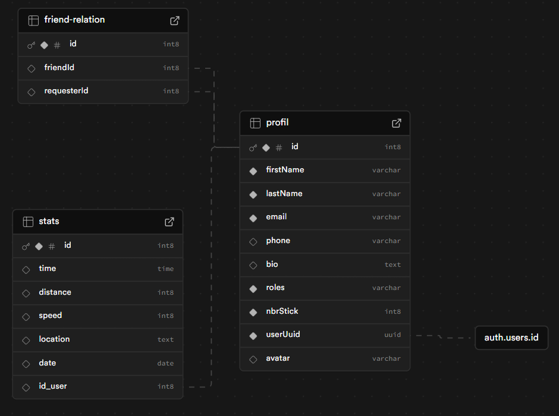
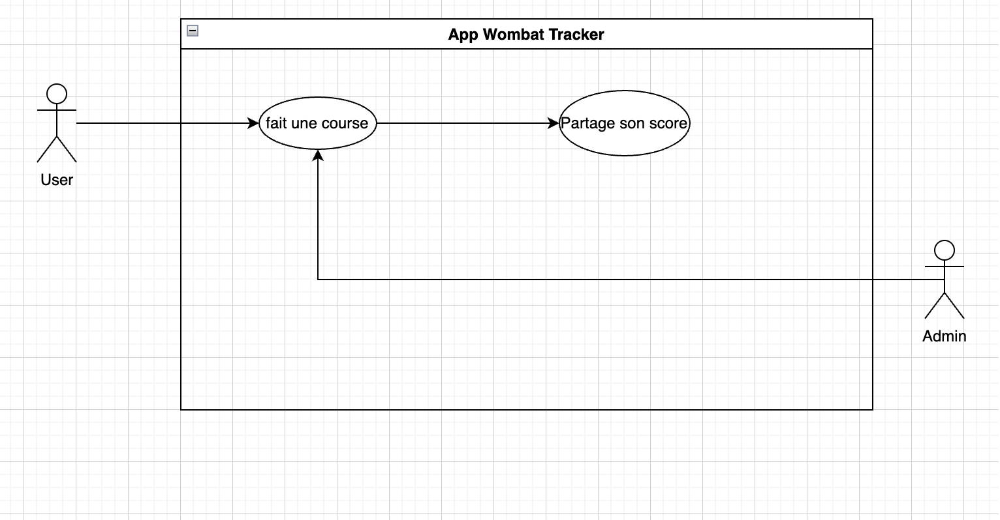
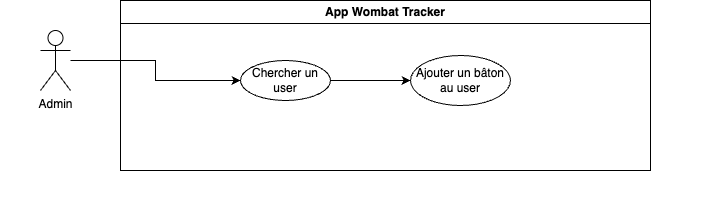
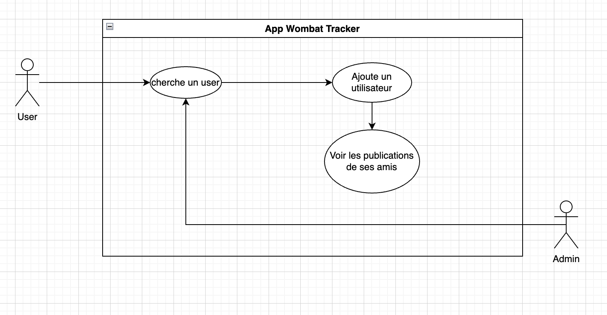

# Wombat Tracker
Application de running en Flutter pour consulter les scores et les statistiques de ses amis.

## Sommaire
1. [Présentation](#-présentation)
2. [Fonctionnalités](#-fonctionnalités)
3. [Architecture technique](#-architecture-technique)
4. [Modélisation de la base de données](#-modélisation-de-la-base-de-données)
5. [Diagramme de classes](#-diagramme-de-classes)
6. [Diagrammes de cas d'utilisation](#-cas-dutilisation)
7. [Captures d’écran](#-captures-décran)
8. [Installation](#-installation)
9. [Technologies utilisées](#-technologies-utilisées)
10. [Contributeurs](#-contributeurs)

## 🧾 Présentation
**Wombat Tracker** est une application permettant aux utilisateurs de consulter et partager leurs statistiques de running, rechercher et ajouter des amis, dans un environnement mobile intuitif.

## ✨ Fonctionnalités

- 🔍 Recherche d'utilisateurs
- ➕ Ajout d'amis
- 👥 Affichage de la liste d’amis
- 🖋️ Modification de son profil
- 📍 Partage et visualisation des sessions de running
- ⛅ Consultation de la météo avant une session
- 🗒️ Gestion des plannings

## 🏗️ Architecture technique

- `utils/` : Appels API, validateurs, helpers
- `test/` : Tests des widgets et fonctions utilitaires
- `widget/` : Composants réutilisables
- `screen/` : Pages principales de l'application

## 🗃️ Modélisation de la base de données

Voici la structure de la base de données Supabase :



_Document complémentaire :_ [`bdd.md`](lib/docs/bdd.md)

## 📦 Diagramme de classes

Ce diagramme UML montre les relations entre les principales classes de l’application :


## 🔁 Cas d'utilisation

1. Partage de sessions de running :



2. Ajout de récompenses par l'administrateur :



3. Partage et affichage des publications :



## 🖼️ Captures d’écran

| Écran de recherche | Résultat | Demande envoyée |
|--------------------|----------|------------------|
|  |  |  |

## ⚙️ Installation

1. Cloner le projet :
   ```bash
   git clone https://github.com/seb-mlrd/diagram-wombat-tracker
   cd wombat-tracker
   flutter pub get
   flutter run


## 🛠️ Technologies utilisées

- Flutter 3.x
- Dart
- Supabase


## 👨‍💻 Contributeurs

- [@seb-mlrd](https://github.com/seb-mlrd)
- [@Yezir971](https://github.com/Yezir971)


