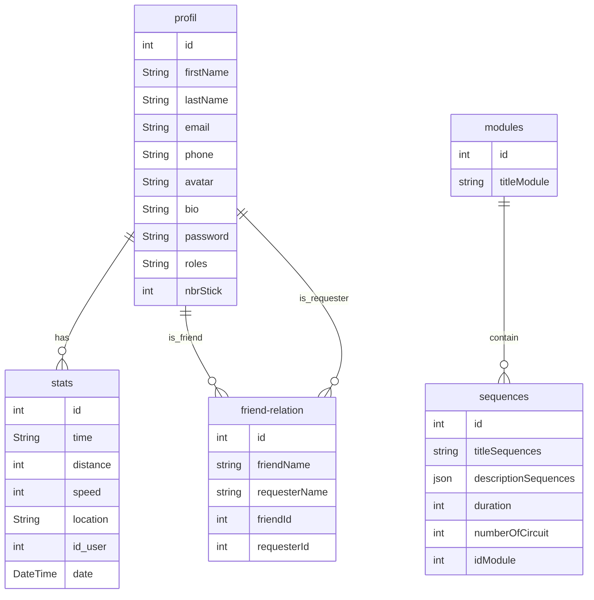

```mermaid
erDiagram
    profil ||--o{ stats : has
    profil ||--o{ friend-relation : is_friend
    profil ||--o{ friend-relation : is_requester
    modules ||--o{ sequences : contain
    profil {
        int id
        String firstName
        String lastName
        String email
        String phone
        String avatar
        String bio
        String password
        String roles
        int nbrStick
    }
    stats {
        int id
        String time
        int distance
        int speed
        String location
        int id_user
        DateTime date
    }
    friend-relation {
        int id
        string friendName
        string requesterName
        int friendId
        int requesterId
    }
    sequences{
        int id 
        string titleSequences
        json descriptionSequences
        int duration
        int numberOfCircuit 
        int idModule
    }
    modules{
        int id
        string titleModule
    }
```