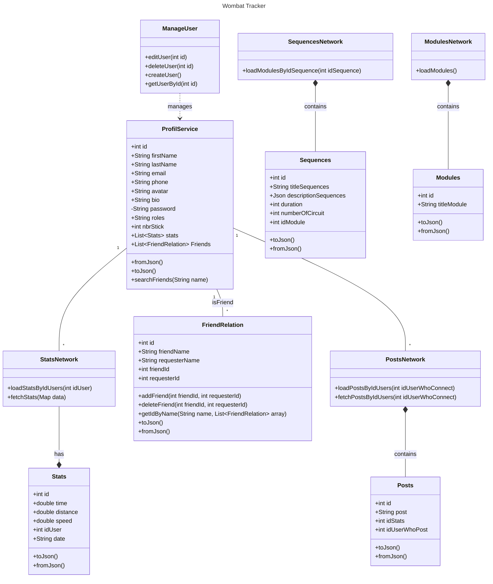

```mermaid

---
title: Wombat Tracker
---

classDiagram
    class ProfilService {
        +int id
        +String firstName
        +String lastName
        +String email
        +String phone
        +String avatar
        +String bio
        -String password
        +String roles
        +int nbrStick
        +List~Stats~ stats
        +List~FriendRelation~ Friends
        +fromJson()
        +toJson()
        +searchFriends(String name)
    }

    class Stats {
        +int id
        +double time
        +double distance
        +double speed
        +int idUser
        +String date
        +toJson()
        +fromJson()
    }
    class StatsNetwork{
        +loadStatsByIdUsers(int idUser)
        +fetchStats(Map data)
    }

    class FriendRelation {
        +int id
        +String friendName
        +String requesterName
        +int friendId
        +int requesterId
        +addFriend(int friendId, int requesterId)
        +deleteFriend(int friendId, int requesterId)
        +getIdByName(String name, List~FriendRelation~ array)
        +toJson()
        +fromJson()
    }


    class ManageUser {
        +editUser(int id)
        +deleteUser(int id)
        +createUser()
        +getUserById(int id)
    }
  
    class Sequences{
        +int id 
        +String titleSequences
        +Json descriptionSequences
        +int duration
        +int numberOfCircuit 
        +int idModule
        +toJson()
        +fromJson()
    }

    class Modules{
        +int id
        +String titleModule
        +toJson()
        +fromJson()
    }
    class ModulesNetwork{
        +loadModules()
    }
    class SequencesNetwork{
        +loadModulesByIdSequence(int idSequence)
    }
    class Posts{
        +int id
        +String post
        +int idStats
        +int idUserWhoPost
        +toJson()
        +fromJson()
    }
    class PostsNetwork{
        +loadPostsByIdUsers(int idUserWhoConnect)
        +fetchPostsByIdUsers(int idUserWhoConnect)
    }

    ProfilService "1" -- "*" FriendRelation : isFriend
    StatsNetwork --* Stats : has
    ProfilService "1"--"*" StatsNetwork 
    ProfilService "1"--"*" PostsNetwork 
    ManageUser ..> ProfilService : manages
    ModulesNetwork *-- Modules : contains
    SequencesNetwork *-- Sequences : contains
    PostsNetwork *-- Posts : contains
```
